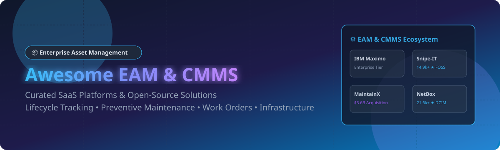

# 🛠️ Awesome Enterprise Asset Management (EAM) & CMMS Solutions 🚀

  

  
  
  
  

---

## 📌 Overview & Market Intelligence 📊

**Curated List of SaaS Platforms & Open-Source GitHub Projects**
*Focused on Asset Lifecycle Management, Maintenance Operations, Work Orders & Reliability Engineering.*

> 💡 **Market Size & Structure**: The Global Enterprise Asset Management (EAM) software market is estimated at **$5.9 Billion - $7.4 Billion (2026)** and projected to reach **$12+ Billion by 2031**. The sector is **moderately fragmented**: mega ERP vendors (Oracle, SAP, IBM) control high-end industrial accounts, while agile SaaS solutions (MaintainX) and open-source infrastructure tools (NetBox, Snipe-IT) capture rapidly expanding mid-market, IT, and mobile-first operations.

This repository tracks notable **SaaS platforms** and **open-source projects** for **Enterprise Asset Management (EAM)** and **Computerized Maintenance Management Systems (CMMS)**. These platforms enable maintenance managers, reliability engineers, facility directors, and IT managers to digitize asset lifecycles, automate preventive maintenance schedules, track inventory, and eliminate unplanned downtime.

---

## 📑 Table of Contents 🗂️

- [☁️ SaaS / Hosted EAM Platforms](#️-saas--hosted-eam-platforms)
- [🔓 Open-Source GitHub Projects](#-open-source-github-projects)
- [🤝 How to Contribute](#-how-to-contribute)
- [☕ Support & Sponsorship](#-support--sponsorship)
- [📈 Star History](#-star-history)
- [⚠️ Disclaimer](#️-disclaimer)

---

## ☁️ SaaS / Hosted EAM Platforms 💼

The SaaS EAM space consists of enterprise-grade suites integrated into corporate ERPs as well as modern, mobile-first CMMS tools. Below is a comparative breakdown sorted by **Company Size / Valuation (Descending)**:

| Platform | Description & Key Features | Starting Tier Price 💳 | Free Plan / Trial Limits ⏳ | Company Valuation / Revenue 💰 |
| :--- | :--- | :--- | :--- | :--- |
| **[Oracle eAM](https://www.oracle.com/)** 🏛️ | Enterprise asset management module integrated into Oracle E-Business Suite & Cloud ERP. Comprehensive lifecycle management, asset tracking, and preventive maintenance. | ~$150 / user / month (Cloud ERP base tier) | 30-Day Free Trial ($300 Cloud credits included) | **~$425 Billion Market Cap** ($67.36B Annual Revenue) |
| **[SAP EAM](https://www.sap.com/products/asset-management.html)** 🏢 | Plant maintenance and work order management native to SAP S/4HANA. Deeply synchronized with financials and supply chain workflows. | ~$110 / user / month (S/4HANA Cloud user licensing) | 14-Day Free Guided Trial (Pre-configured S/4HANA sandbox) | **~$230 Billion Market Cap** (€36.8B / ~$42.4B Annual Revenue) |
| **[IBM Maximo](https://www.ibm.com/products/maximo)** ⚙️ | Market-leading industrial EAM suite with predictive maintenance, AI-driven asset health, and mobile work management across asset-intensive sectors. | ~$3,150 / month (MAS SaaS Base Starter Tier) | 14-Day Free Trial (Access restricted to Manage & Health modules) | **~$200 Billion Market Cap** (IBM Enterprise Software Division) |
| **[Infor EAM](https://www.infor.com/products/eam)** 🏭 | Specialized enterprise asset management for healthcare, manufacturing, and fleet operations with native mobile field service capabilities. | ~$75 / user / month (Enterprise Cloud subscription) | 14-Day Free Sales-Guided Demo / Sandbox Trial | **~$13 Billion Valuation** (Koch Industries Subsidiary) |
| **[IFS Cloud EAM](https://www.ifs.com/)** ✈️ | Full lifecycle EAM for heavy industrial sectors including aerospace, defense, energy, and maritime with predictive asset maintenance. | ~$100 / user / month (Enterprise subscription tier) | 14-Day Guided Enterprise Sandbox Demo | **>€15 Billion Valuation** (€1.2B+ Annual Revenue) |
| **[HxGN EAM](https://www.hexagon.com/)** 🗺️ | Geospatial-centric EAM from Hexagon featuring native GIS integration via ESRI ArcGIS & OpenLayers for linear and point assets. | ~$90 / user / month (Professional SaaS tier) | 14-Day Guided Interactive Demo Account | **~$24 Billion Market Cap** (Hexagon AB Parent - €3.7B Net Sales) |
| **[Brightly Asset Essentials](https://www.brightlysoftware.com/)** 🏫 | Facility and operations management platform tailored for education, government, and commercial facilities maintenance. | ~$1,200 / year (~$100/mo base facility license) | 14-Day Free Trial (Full feature access for up to 5 users) | **~$17 Billion Parent Market Cap** (Fortive Corporation - $4.3B Revenue) |
| **[MaintainX Enterprise](https://www.maintainx.com/)** 📱 | Mobile-first frontline CMMS platform for work orders, procedures, and inventory tracking with fast onboarding and AI tools. | $20 / user / month (Essential Plan; Enterprise at $65/user/mo) | **Free Forever Basic Plan** (Limited to 2 active repeating PM work orders & 1 month history) | **$3.6 Billion Acquisition Value** (Acquired by Autodesk; $135M+ ARR) |
| **[Fracttal One](https://www.fracttal.com/)** ⚡ | Cloud-native, IoT-connected CMMS/EAM platform for agile work order creation, equipment monitoring, and maintenance management. | $229 / month (Starter Plan up to 10 users) | **Free Forever Community Plan** (Limited to 1 user, 10 assets & basic work orders) | **~$15 Million Revenue** (Venture-backed, $50M+ total funding raised) |
| **[AssetWorks](https://www.assetworks.com/)** 🚚 | Comprehensive fleet, fuel, and public sector physical asset management system for government agencies and large transport fleets. | Quote-based (~$50 / user / month estimated starter) | 14-Day Custom Sandbox Demo (Available upon request) | Private Enterprise (~$50M-$100M estimated revenue) |

---

## 🔓 Open-Source GitHub Projects 🌐

Open-source CMMS and EAM software gives organizations complete ownership of sensitive asset data, eliminates per-user SaaS license fees, and allows deep custom developer integrations. 

Sorted by **GitHub Stars_Count (Descending)**:

- **[NetBox](https://github.com/netbox-community/netbox)**  📡
  The premier open-source Infrastructure Resource Management (IRM) and IP Address Management (IPAM) platform designed for data centers and network asset tracking. Built on Django/Python. **Apache-2.0**.

- **[Snipe-IT](https://github.com/grokability/snipe-it)**  💻
  The most popular open-source IT asset management (ITAM) platform. Features hardware asset tracking, license management, barcode/QR code label generation, check-in/check-out workflows, and user assignment. Built on Laravel/PHP. **AGPL-3.0**.

- **[InvenTree](https://github.com/inventree/InvenTree)**  📦
  Intuitive open-source inventory and asset management system designed for lightweight industrial manufacturing, component tracking, and stock lifecycle management. Built on Python/Django. **MIT License**.

- **[GLPI](https://github.com/glpi-project/glpi)**  🖥️
  Free open-source IT Service Management (ITSM) and asset management software package. Features helpdesk ticket management, hardware/software inventory, financial tracking, LDAP integration, and Gantt charts. **GPL-3.0**.

- **[Shelf](https://github.com/Shelf-nu/shelf.nu)**  🏷️
  Modern open-source asset management infrastructure. Allows tracking equipment, asset tags, location history, and QR labels with a sleek TypeScript UI. **MIT License**.

- **[Ralph](https://github.com/allegro/ralph)**  🏢
  Full-featured Enterprise Asset Management (EAM), Data Center Infrastructure Management (DCIM), and CMDB platform for corporate IT and back-office infrastructure. **Apache-2.0**.

- **[Nautobot](https://github.com/nautobot/nautobot)**  🔌
  Network infrastructure automation platform and Source of Truth (SoT) for infrastructure assets, network hardware, and lifecycle automation. **Apache-2.0**.

- **[PartKeepr](https://github.com/partkeepr/PartKeepr)**  🔌
  Open-source electronic component and spare parts asset management system designed to track inventory levels, distributors, and maintenance parts. **GPL-3.0**.

- **[CMDBuild](https://github.com/itmicus/cmdbuild_docker)**  ⚙️
  Open-source web environment for configuring custom asset management applications. Low-code platform supporting database modeling, workflow management, 3D BIM model viewing (IFC format), and GIS integration. **AGPL-3.0**.

- **[openMAINT](https://github.com/rsilva4-zz/docker-openmaint)**  🏗️
  Derived from CMDBuild, openMAINT is specifically designed for real estate, facility management, and logistics asset maintenance. Includes work order management, preventive maintenance, and GIS asset mapping. **AGPL-3.0**.

- **[Open-Source CMMS (SuperCMMS)](https://github.com/SuperCMMS/Open-Source-CMMS)**  🛠️
  Backend architecture and API for a modern open-source CMMS. Supports work orders, corrective/predictive maintenance, checklists, QR codes, and document repositories. **MIT License**.

- **[BaseEAM](https://github.com/baseeam/baseeam-web-app)**  🧰
  Enterprise Asset Management and CMMS built on .NET. Features multi-site data security, work order management, technician scheduling, craft tracking, and customizable flowcharts. **Open Source**.

- **[WCC CMMS](https://github.com/devdave-online/WCC_CMMS)**  📲
  Unlimited-seat maintenance management software with 34 language translations, offline Android companion app, AI assistant integration, and reliability KPIs (MTTR, MTBF). **Apache-2.0 + Commons Clause**.

---

## 🤝 How to Contribute 💡

Contributions are warmly welcome! If you'd like to add a new EAM/CMMS tool or update existing information:

1. **Fork** this repository.
2. Edit `README.md` keeping formatting, tables, and links consistent.
3. Ensure pricing, free trial, and Stars_Badges are accurate.
4. Submit a **Pull Request** with a brief note explaining your addition.

Please visit [Awesome-Awesome-Awesome](https://github.com/ishandutta2007/Awesome-Awesome-Awesome) for more curated lists!

---

## ☕ Support & Sponsorship 💖

If you find this repository helpful for your operational research, facility planning, or open-source stack evaluation:

- ⭐ **Star** this repository on GitHub to show support!
- 🍴 **Fork** it to keep a personal reference.
- 📢 **Share** it with fellow reliability engineers, maintenance managers, and IT ops teams.
- ☕ **Buy me a coffee / Sponsor**: If you'd like to support open-source maintenance tools, consider sponsoring via the link below:

  

---

## 📈 Star History 📊

---

## ⚠️ Disclaimer 📋

- This list is **community-curated** for educational and research purposes.
- EAM and CMMS platforms handle critical operational, financial, and industrial safety data; evaluate compliance with ISO 55000, SOC2, and local regulations prior to deployment.
